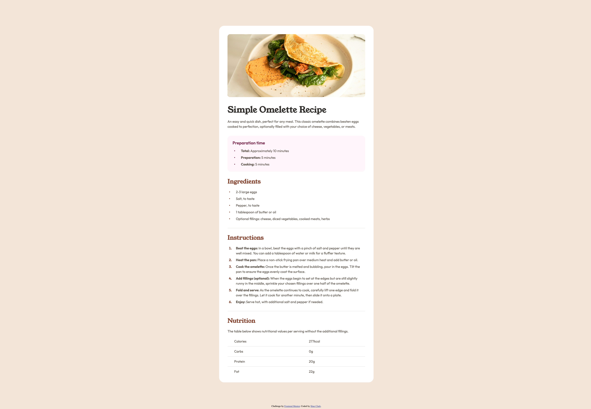

# Frontend Mentor - Recipe page solution

This is a solution to the [Recipe page challenge on Frontend Mentor](https://www.frontendmentor.io/challenges/recipe-page-KiTsR8QQKm). Frontend Mentor challenges help you improve your coding skills by building realistic projects. 

## Table of contents

- [Overview](#overview)
  - [The challenge](#the-challenge)
  - [Screenshot](#screenshot)
- [My process](#my-process)
  - [Built with](#built-with)
  - [What I learned](#what-i-learned)
  - [Continued development](#continued-development)
- [Author](#author)
- [Acknowledgments](#acknowledgments)

## Overview

Went for pixel perfect with responsive design, avoiding hard pixel configs and aiming for rem focus. Also aimed for less sloppy design, implementing semantic html when I thought it made sense. Trying to hit pixel perfect was 80% of the battle on this one. Viable product quickly with last odds and ends taking bulk of time. Still a fun experience with good practice involving clamp and tables.

Hardest part was by far matching up the li with the mock-up. Required a lot of custom config to get it right, and that took up a huge chunk of the time as I have not run into the issue before (normally I am not going so directly from a mock-up). 

Additional problem seen was that `
` seemed like a logical inclusion, but they took up 1px each, which shifted the product outcome. Had to use some `::after` settings applied to some invisible divs.

I also rarely used clamp previously and I think that will change in the future. Seems very useful.

### Screenshot

## My process

Went off Figma, established constants where I could, and built out. Then compared my results with mock-up and made adjustments necessary to get my assumptions in check of how page would behave.

### Built with

- Semantic HTML5 markup
- CSS custom properties
- Flexbox

### What I learned

Clamp settings, behavior of `
` in document, how much list decorators/styles can induce rage if you have an exact image in mind rather than go with the flow, how much `<table>` design is outside my normal wheelhouse.

### Continued development

I'm happy with the end result, although I would love to hear from an experienced web dev exactly where I introduced unnecessary redundancy and made my life harder than it needed to be (besides the obvious of pixel-perfect being unnecessary). I think it wowuld be interesting to redo this while forgoing that end goal of 1:1 matching the mockup and seeing how different it looks in the code, as I think I would make some QOL changes. Additionally, I am curious how to plan out my resolution shifts better, as I am currently going off general feel.

## Author

- Frontend Mentor - [@MalakDynamics](https://www.frontendmentor.io/profile/MalakDynamics)

## Acknowledgments

Thanks to Frontend Mentor for all the assets and practice projects!
